<h1 align="center">BhandsMusic Web</h1>

<p align="center">
  
</p>

沉浸式在线音乐播放器 —— 将 BhandsMusic Electron 桌面应用迁移为 Web 网页版。

🌐 **在线体验**：[https://bhands.icu](https://bhands.icu)

前端 React 19 + Three.js 粒子视觉，后端 Fastify + NeteaseCloudMusicApi，支持多音源、逐字歌词、天气电台与十余种实时音乐可视化效果。

---

## ✨ 界面预览


**首页**（未登录 / 已登录）

<p align="center">
  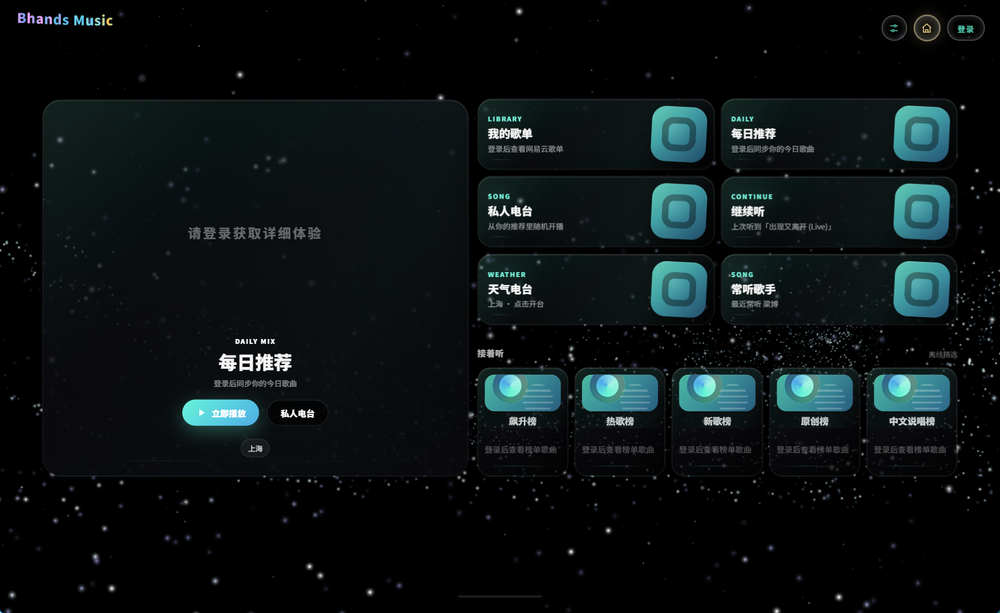
  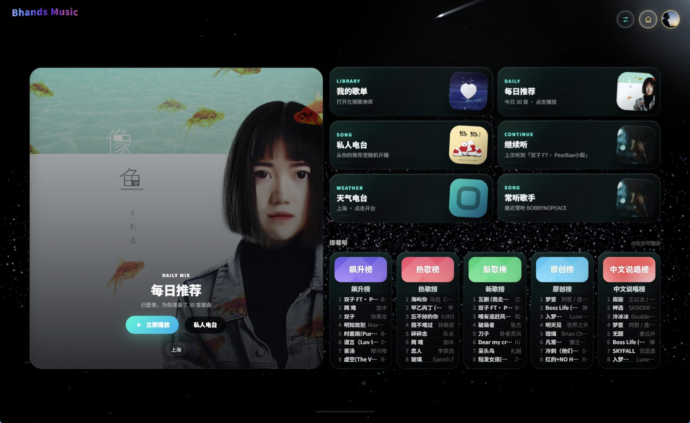
</p>


## 🌌 粒子视觉效果

全部效果由 GLSL 粒子着色器实时驱动，随音乐节拍与频谱联动：

| | | |
|:---:|:---:|:---:|
| <br>**音谱** |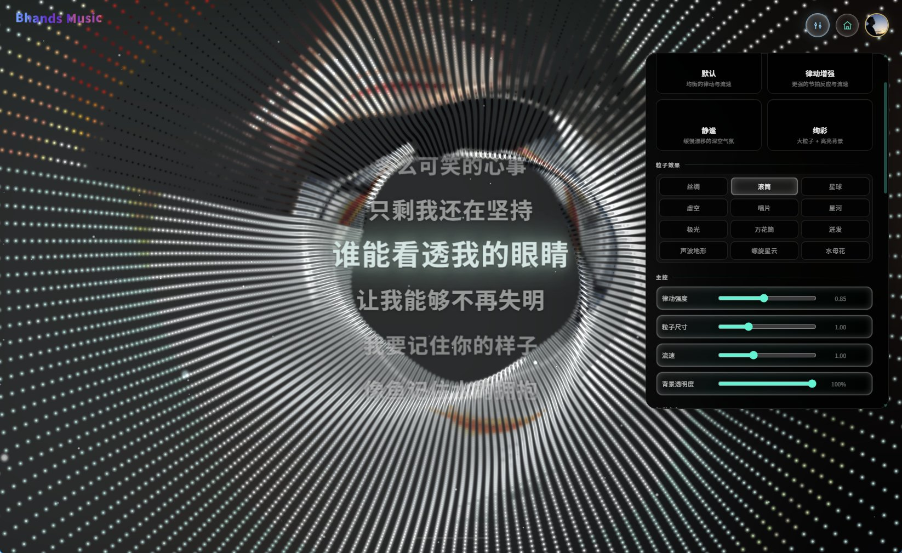<br>**流星** | <br>**寰宇** | 
| 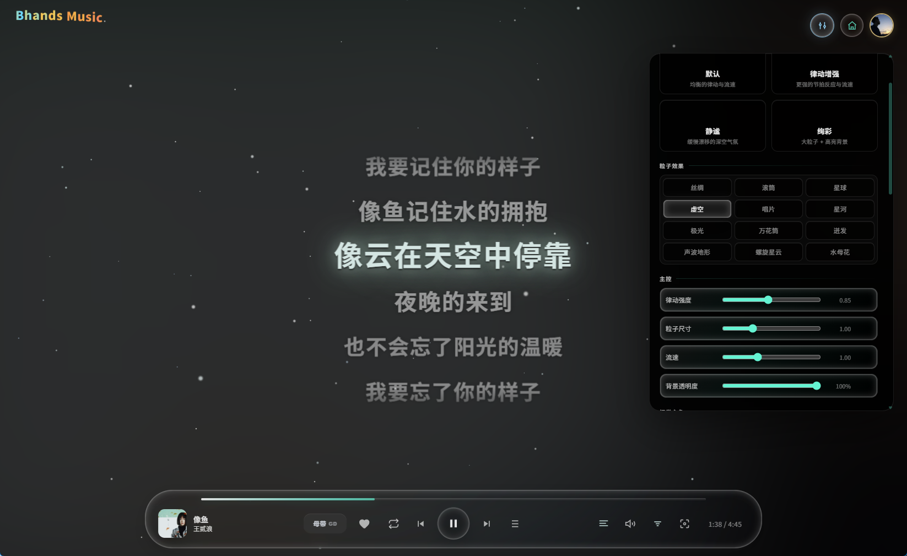<br>**真空** |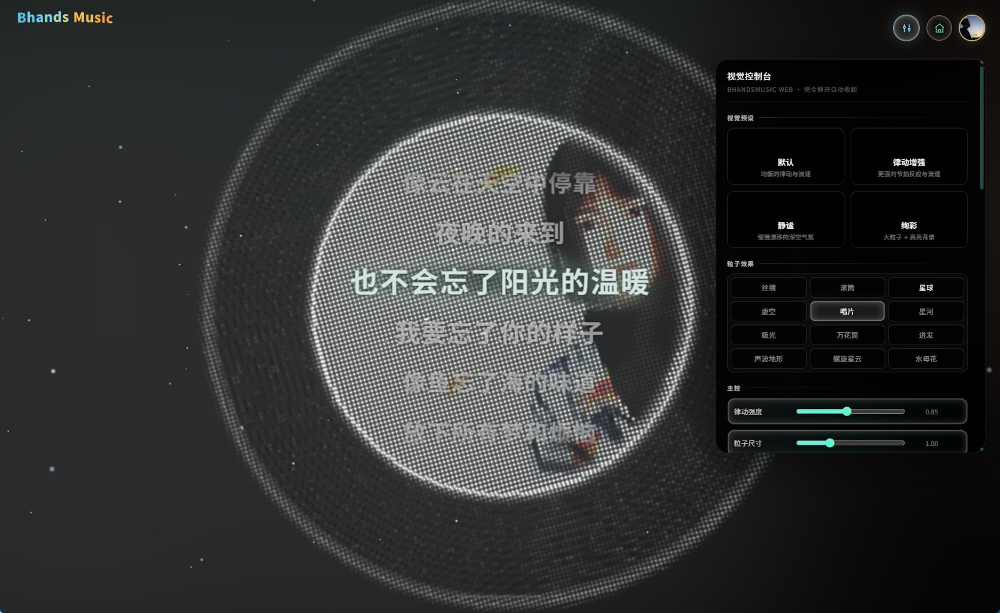<br>**照片** | 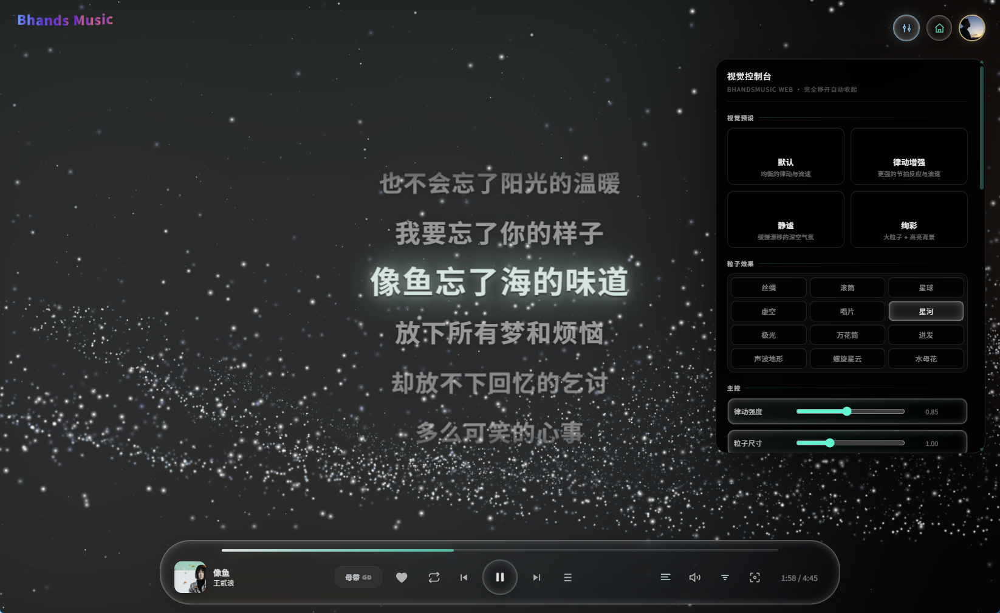<br>**银河** | 
| 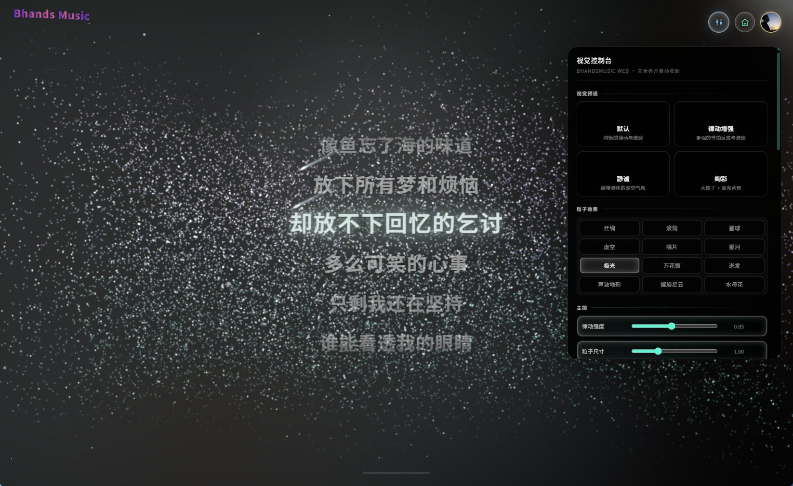<br>**极光** |<br>**万花筒** | 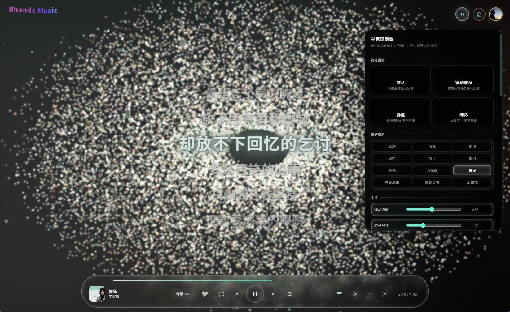<br>**迸发** | 
| 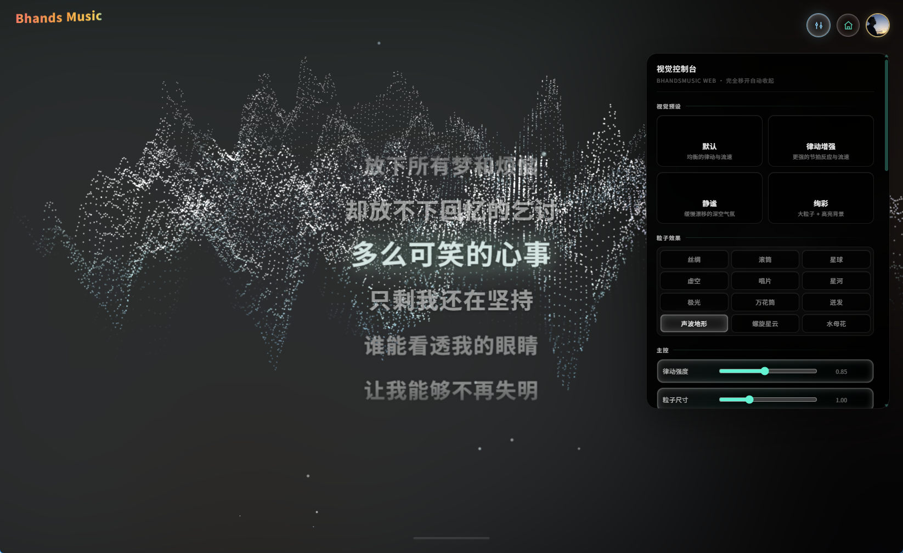<br>**声波地形** |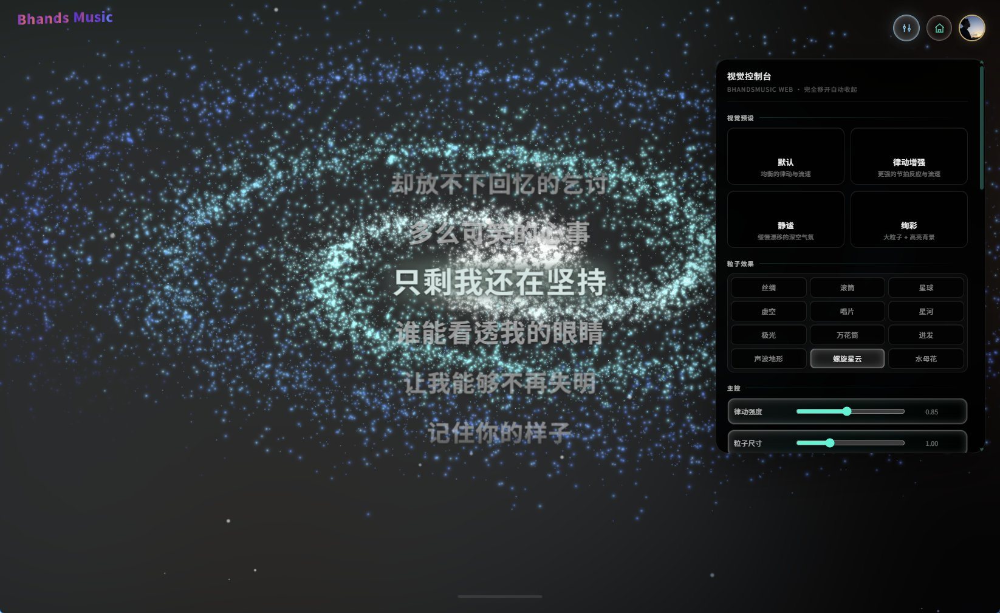<br>**螺旋星云** | 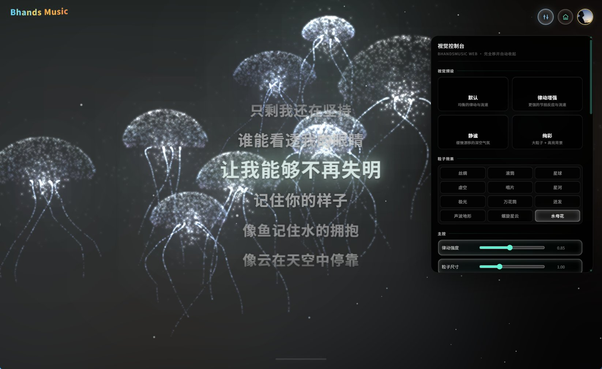<br>**水母花** |

## 🎵 功能特性

### P0 - 核心功能
- 音乐播放 / 搜索
- 多音源支持（网易官方 + 自定义音源脚本）
- 逐字 / 翻译歌词显示
- 播放队列

### P1 - 增强功能
- 播放列表管理
- 播放历史
- 收藏功能
- 天气电台（按当地天气智能推荐）

### P2 - 视觉系统
- 粒子视觉（流星 / 寰宇 / 真空 / 银河 / 螺旋星云 / 水母花等十余种预设）
- 节拍可视化
- 壁纸模式

### P3 - 3D 系统
- Three.js 集成
- 3D 歌单架
- 3D 视觉效果

### P4 - 高级功能
- 本地音乐支持
- PWA 支持
- 移动端适配

### P5 - 扩展功能
- 网易云账号扫码登录
- LX 音源沙盒（worker_threads + vm 隔离运行自定义音源脚本）
- VIP 会员等级标识

## 🛠️ 技术栈

### 前端
- React 19 + TypeScript + Vite
- Zustand（状态管理）
- Three.js（3D 渲染）+ 自研 GLSL 粒子着色器
- GSAP（动画）
- Axios（HTTP 客户端）

### 后端
- Node.js + Fastify
- NeteaseCloudMusicApi
- worker_threads + vm 沙盒（LX 音源脚本隔离执行）
- Docker Compose + Caddy（生产部署）

## 🚀 快速开始

> 前置要求：Node.js ≥ 18

### 方式一：Windows 一键本地部署（推荐）

1. 下载项目（或分发包）并解压
2. 双击根目录的 **`deploy-local.bat`**
3. 脚本自动完成：安装依赖 → 构建前端 → 启动服务 → 打开浏览器

完成后访问 [http://localhost:3001](http://localhost:3001) 即可使用。

### 方式二：手动部署

```bash
# 1. 安装依赖
npm install

# 2. 构建
npm run build

# 3. 启动（单端口 3001，同时托管前端静态资源与 API）
npm start
```

### 开发模式

```bash
# 前后端并行启动（前端 5173 / 后端 3001）
npm run dev
```

## 🖥️ 服务器部署

项目使用 Docker Compose 部署，Caddy 提供 HTTPS 反代：

```bash
# 构建并启动（caddy profile 启用反向代理）
docker compose build
docker compose --profile caddy up -d
```

维护者可使用 `deploy.bat [build|upload|all]` 一键完成「本地构建 → 上传 → 远程重建」。

### 音频 302 直连

`/api/music/stream` 对网易 https 直链默认返回 **302 重定向**，让音频流量直连 CDN、绕过服务器带宽（适合小带宽服务器）。如需恢复服务器代理模式：

```env
STREAM_DIRECT_REDIRECT=off
```

### 常用环境变量

| 变量 | 说明 | 默认 |
|---|---|---|
| `PORT` | 服务端口 | `3001` |
| `HOST` | 监听地址 | `0.0.0.0` |
| `SESSION_PERSIST` | 登录会话持久化 | `on` |
| `STREAM_DIRECT_REDIRECT` | 音频 302 直连开关 | `on` |
| `TRUST_PROXY` | 信任反向代理头（取真实 IP） | `0` |

完整配置见 [.env.example](.env.example)。

## 📁 项目结构

```
Bhands_Web/
├── apps/
│   ├── web/                    # 前端应用
│   │   ├── src/
│   │   │   ├── components/     # React 组件
│   │   │   ├── pages/          # 页面组件
│   │   │   ├── stores/         # Zustand 状态管理
│   │   │   ├── audio/          # 音频引擎
│   │   │   ├── visual/         # 视觉系统（粒子预设）
│   │   │   ├── lyrics/         # 歌词系统
│   │   │   ├── playlist/       # 播放列表
│   │   │   ├── weather/        # 天气系统
│   │   │   └── three/          # Three.js 3D
│   │   └── vite.config.ts
│   │
│   └── server/                 # 后端服务
│       ├── src/
│       │   ├── routes/         # API 路由
│       │   ├── services/       # 业务服务
│       │   ├── adapters/       # 适配器
│       │   └── middleware/     # 中间件
│       └── tsconfig.json
│
├── deploy-local.bat            # Windows 一键本地部署
├── .env.example                # 环境变量示例
└── docs/screenshots/           # 界面截图
```

## 📖 开发指南

### 添加新页面
1. 在 `apps/web/src/pages/` 创建新组件
2. 在 `apps/web/src/App.tsx` 添加路由
3. 更新导航组件

### 添加新 API
1. 在 `apps/server/src/routes/` 创建路由文件
2. 在 `apps/server/src/index.ts` 注册路由
3. 在 `apps/web/src/api/` 创建 API 客户端

### 添加新状态
1. 在 `apps/web/src/stores/` 创建 Zustand store
2. 在组件中使用 `useStore` hook

## 🤝 贡献指南

1. Fork 项目
2. 创建功能分支 (`git checkout -b feature/AmazingFeature`)
3. 提交更改 (`git commit -m 'Add some AmazingFeature'`)
4. 推送到分支 (`git push origin feature/AmazingFeature`)
5. 创建 Pull Request

## 📄 许可证

ISC License
