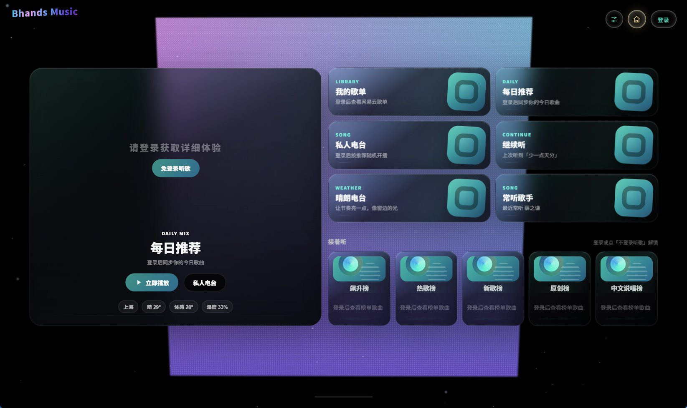
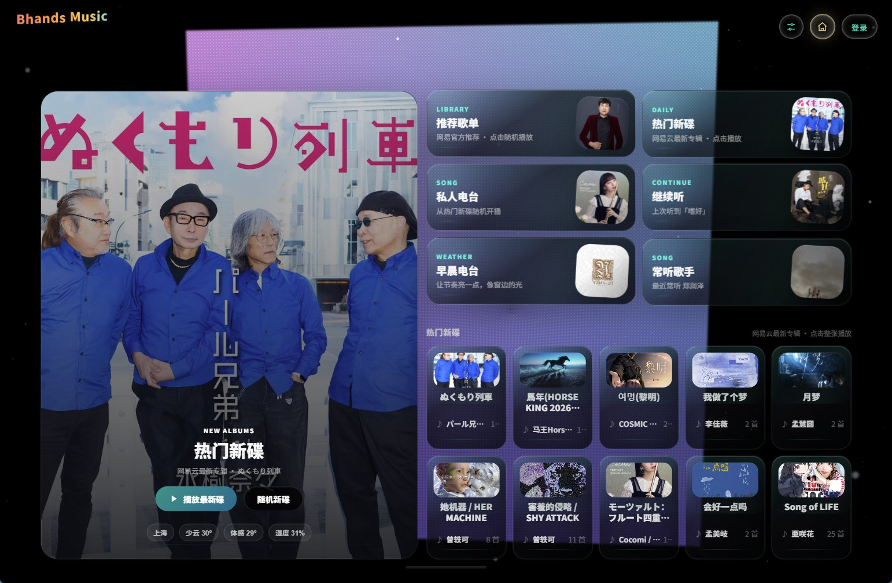
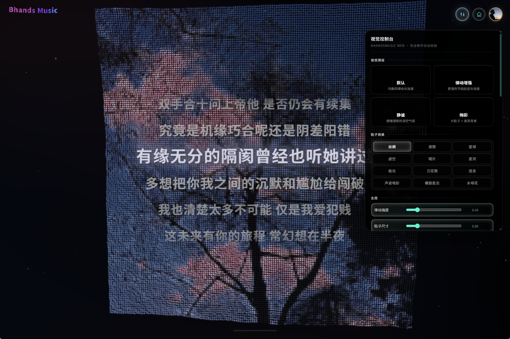
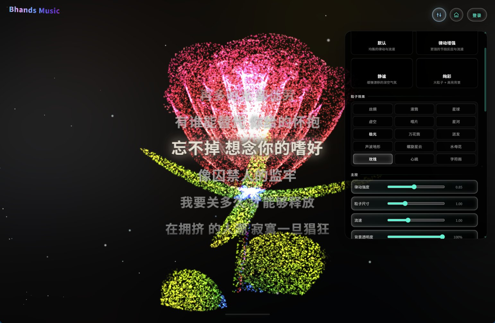
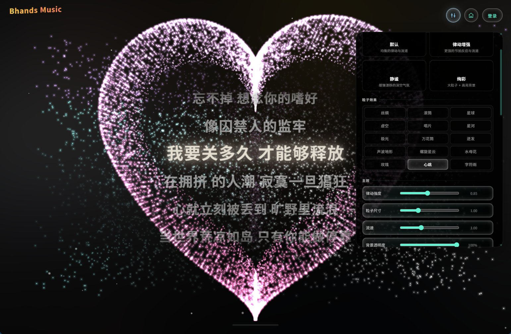
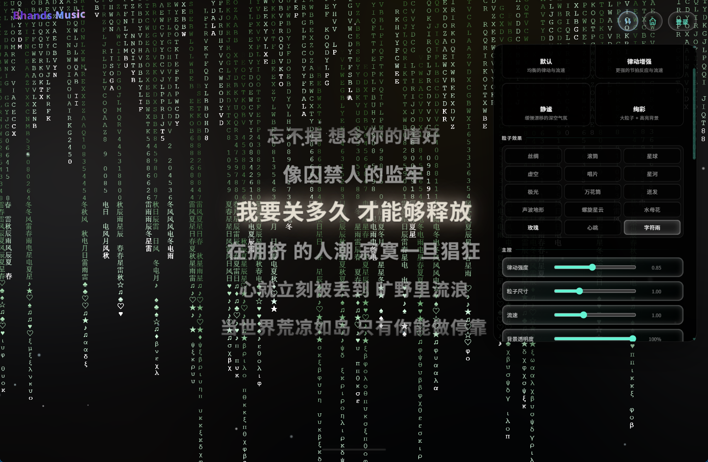

<h1 align="center">BhandsMusic Web</h1>

<h1 align="center">沉浸式在线音乐播放器 · 让音乐看得见</h1>

<p align="center">
  
</p>

🌐 **在线体验**：[https://bhands.icu](https://bhands.icu)

沉浸式在线音乐播放器 —— 将 [BhandsMusic Electron 桌面应用](https://github.com/Bhands6/BhandsMusicChange) 迁移为 Web 网页版。

前端 React 19 + Three.js 粒子视觉，后端 Fastify + NeteaseCloudMusicApi，支持多音源、逐字歌词、天气电台与 15 种实时音乐可视化效果。

---

## ✨ 界面预览


**首页**（未登录 / 免登录页 / 登录后）

<p align="center">
  
  
  
</p>


## 🌌 粒子视觉效果

全部效果由 GLSL 粒子着色器实时驱动，随音乐节拍与频谱联动：

| | | |
|:---:|:---:|:---:|
| <br>**丝绸** |<br>**滚筒** | <br>**星球** | 
| <br>**虚空** |<br>**唱片** | <br>**星河** | 
| <br>**极光** |<br>**万花筒** | <br>**迸发** | 
| <br>**声波地形** |<br>**螺旋星云** | <br>**水母花** | 
| <br>**玫瑰** |<br>**心跳** | <br>**字符雨** | 

## 🎵 功能特性

| | |
|:---|:---|
| **核心** | 音乐播放 / 搜索 · 多音源（网易官方 + 自定义音源脚本）· 逐字 / 翻译歌词 · 播放队列 |
| **增强** | 播放列表管理 · 播放历史 · 收藏 · 天气电台（按当地天气智能推荐） |
| **视觉** | 粒子视觉（丝绸 / 星球 / 星河 / 极光 / 螺旋星云 / 水母花 / 数学玫瑰 / 心跳 / Matrix 字符雨等 15 种预设）· 节拍可视化 · 壁纸模式 |
| **3D** | Three.js 集成 · 3D 歌单架 · 3D 视觉效果 |
| **高级** | 本地音乐支持 · PWA · 移动端适配 |
| **扩展** | 网易云账号扫码登录 · LX 音源沙盒（worker_threads + vm 隔离运行自定义脚本）· VIP 会员等级标识 |

## 🛠️ 技术栈

### 前端
- React 19 + TypeScript + Vite
- Zustand（状态管理）
- Three.js（3D 渲染）+ 自研 GLSL 粒子着色器
- GSAP（动画）
- Axios（HTTP 客户端）

### 后端
- Node.js + Fastify
- NeteaseCloudMusicApi
- worker_threads + vm 沙盒（LX 音源脚本隔离执行）
- Docker Compose + Caddy（生产部署）

## 🚀 快速开始

> 前置要求：Node.js ≥ 18

### 方式一：Windows 一键本地部署（推荐）

1. 下载项目（或分发包）并解压
2. 双击根目录的 **`deploy-local.bat`**
3. 脚本自动完成：安装依赖 → 构建前端 → 启动服务 → 打开浏览器

完成后访问 [http://localhost:6628](http://localhost:6628) 即可使用。

### 方式二：手动部署

```bash
# 1. 安装依赖
npm install

# 2. 构建
npm run build

# 3. 启动（单端口 6628，同时托管前端静态资源与 API）
npm start
```

### 开发模式

```bash
# 前后端并行启动（前端 5173 / 后端 6628）
npm run dev
```

### 更新升级

```bash
# 拉取最新代码后重新构建并启动
git pull
docker compose build
docker compose --profile caddy up -d
```

Windows 本地部署同理：重新运行 `deploy-local.bat` 即可（自动重装依赖 → 重建 → 重启）。

### 音频 302 直连

`/api/music/stream` 对网易 https 直链默认返回 **302 重定向**，让音频流量直连 CDN、绕过服务器带宽（适合小带宽服务器）。如需恢复服务器代理模式：

```env
STREAM_DIRECT_REDIRECT=off
```

### 常用环境变量

| 变量 | 说明 | 默认 |
|---|---|---|
| `PORT` | 服务端口 | `6628` |
| `HOST` | 监听地址 | `0.0.0.0` |
| `SESSION_PERSIST` | 登录会话持久化 | `on` |
| `STREAM_DIRECT_REDIRECT` | 音频 302 直连开关 | `on` |
| `TRUST_PROXY` | 信任反向代理头（取真实 IP） | `0` |
| `GO_MUSIC_API_URL` | go-music-api 智能换源服务地址（容器内网） | 容器编排内自动注入 |

完整配置见 [.env.example](.env.example)。

## 📁 项目结构

```
Bhands_Web/
├── apps/
│   ├── web/                    # 前端应用
│   │   ├── src/
│   │   │   ├── api/            # API 客户端
│   │   │   ├── components/     # React 组件（含 ParticleStage 粒子舞台 + GLSL 着色器）
│   │   │   ├── pages/          # 页面组件
│   │   │   ├── stores/         # Zustand 状态管理
│   │   │   ├── audio/          # 音频引擎
│   │   │   ├── visual/         # 视觉系统（粒子预设参数）
│   │   │   ├── lyrics/         # 歌词系统
│   │   │   ├── playlist/       # 播放列表
│   │   │   ├── weather/        # 天气系统
│   │   │   ├── hooks/          # 自定义 Hooks
│   │   │   ├── utils/          # 工具函数
│   │   │   └── three/          # Three.js 3D
│   │   └── vite.config.ts
│   │
│   └── server/                 # 后端服务
│       ├── src/
│       │   ├── routes/         # API 路由
│       │   ├── services/       # 业务服务
│       │   ├── adapters/       # 适配器
│       │   ├── config/         # 配置
│       │   └── middleware/     # 中间件
│       └── tsconfig.json
│
├── deploy-local.bat            # Windows 一键本地部署
├── docker-compose.yml          # 生产部署编排（web + caddy + go-music-api）
├── .env.example                # 环境变量示例
└── docs/screenshots/           # 界面截图
```

## 📖 开发指南

### 添加新页面
1. 在 `apps/web/src/pages/` 创建新组件
2. 在 `apps/web/src/App.tsx` 添加路由
3. 更新导航组件

### 添加新 API
1. 在 `apps/server/src/routes/` 创建路由文件
2. 在 `apps/server/src/index.ts` 注册路由
3. 在 `apps/web/src/api/` 创建 API 客户端

### 添加新状态
1. 在 `apps/web/src/stores/` 创建 Zustand store
2. 在组件中使用 `useStore` hook

### 添加新粒子预设
1. 在 `apps/web/src/components/particleShaders.ts` 添加常量与顶点着色器分支（GLSL ES 1.00：`pow` 负底数必须 clamp 包裹，sin³ 用连乘代替）
2. 在 `apps/web/src/stores/useSettingsStore.ts` 的 `ParticleEffect` 联合类型注册，并核对各画质档粒子池规模
3. 在 `apps/web/src/components/particleShaders.test.ts` 补断言（注意：vitest 须在 `apps/web` 目录下运行）
4. 若含音频联动，只接亮度 / 缩放等观感量，不接位置量

### 测试与质量

```bash
npm test          # 双端 vitest（web + server，共 230+ 用例）
npm run lint      # oxlint
```

> ⚠️ vitest 必须在 `apps/web` / `apps/server` 目录下运行，仓库根目录缺少 vitest 配置会报 jsdom 假错误。

## ❓ 常见问题

<details>
<summary><b>端口 6628 被占用 / 想换端口？</b></summary>

启动前设置环境变量 `PORT` 即可（如 `set PORT=8080` 后再 `npm start`）；Docker 部署改 `docker-compose.yml` 中的端口映射与 `PORT`。一键部署用户改 `deploy-local.bat` 里的 `PORT`。
</details>

<details>
<summary><b>扫码登录二维码不显示 / 频繁掉线？</b></summary>

网易云接口偶发抖动属正常，重试即可；掉线与 `SESSION_PERSIST` 有关，`on` 时会话持久化到磁盘，重启服务不丢失登录态。
</details>

<details>
<summary><b>公网部署后外网访问不了？</b></summary>

检查三件事：① 云防火墙/安全组放行 80、443（直连 API 场景另放行 `PORT`）；② DNS 已解析到服务器 IP；③ 若改过 `Caddyfile`，记得重启 caddy 容器。
</details>

<details>
<summary><b>自定义音源脚本怎么用？</b></summary>

登录管理员后在面板「音源脚本管理」上传 LX 格式 `.js` 脚本，脚本在 worker_threads + vm 沙盒中一次性解析执行、不落盘留存；内置音源随服务自动加载，不可删除。
</details>

### 第三方音乐平台说明

第三方平台接入仅用于个人学习、本地客户端体验和用户自有账号的播放辅助。请遵守对应平台的用户协议、版权规则和会员权益规则。

## 📄 许可证

ISC License
